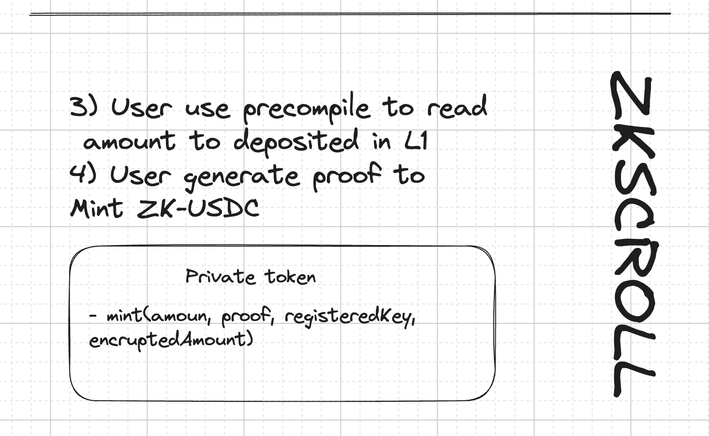

# MERCADO BARRANI <small>A ZK-USDC Privacy Token</small>


## Table of Contents

- [Introduction](#Introduction)
- [Workflow](#Workflow)
- [Contracts](#Contracts)
- [Circuits](#Circuits)
- [Citations and References](#Citations-and-References)
- 

## Introduction

TODO

## Workflow




## Contracts

### Layer 1 Contracts

<details>

<summary>Layer 1 vault and deposit contract: 0x4DFB5C0F45AE4e0C4cA57E0238FcCcfAb9b36003</summary>

Deployed with command:
```sh
forge script script/Layer1.s.sol --rpc-url=https://eth-sepolia.public.blastapi.io --verify --private-key=0x... --etherscan-api-key=...
[⠊] Compiling...
No files changed, compilation skipped
Script ran successfully.

== Return ==
vault: contract Vault 0x4DFB5C0F45AE4e0C4cA57E0238FcCcfAb9b36003

## Setting up 1 EVM.

==========================

Chain 11155111

Estimated gas price: 7.003102858 gwei

Estimated total gas used for script: 777896

Estimated amount required: 0.005447685700826768 ETH

==========================

##### sepolia
✅  [Success]Hash: 0xf4c0e86dc5483fa0fbaa09b46c4708e11d86e03be2c7b1ccb9c026bb88f8353d
Contract Address: 0x4DFB5C0F45AE4e0C4cA57E0238FcCcfAb9b36003
Block: 6431154
Paid: 0.00244380533625144 ETH (598640 gas * 4.082262021 gwei)

✅ Sequence #1 on sepolia | Total Paid: 0.00244380533625144 ETH (598640 gas * avg 4.082262021 gwei)
...
Submitting verification for [src/Layer1/Vault.sol:Vault] 0x4DFB5C0F45AE4e0C4cA57E0238FcCcfAb9b36003.
Submitted contract for verification:
        Response: `OK`
```

</details>


### ZK-Scroll Contracts


## Circuits

Mint circuit

Transfer to new

Transfer

Burn

## Citations and References

It would be impossible to me do this with out the awesome work of other researchers that have done all the hard work for me :D

- https://files.sri.inf.ethz.ch/website/papers/sp22-zeestar.pdf
- https://es.wikipedia.org/wiki/Cifrado_ElGamal
- **Most or circuit are based on this post:** https://medium.com/@jat9292zksnarks-homomorphic-encryption-ethereums-privacy-new-frontier-b30357236a7a]
- https://github.com/colinnielsen/ecrecover-noir/tree/main
- https://github.com/Foulks-Plb/noir-lang-zkp-homomorphic/tree/main
